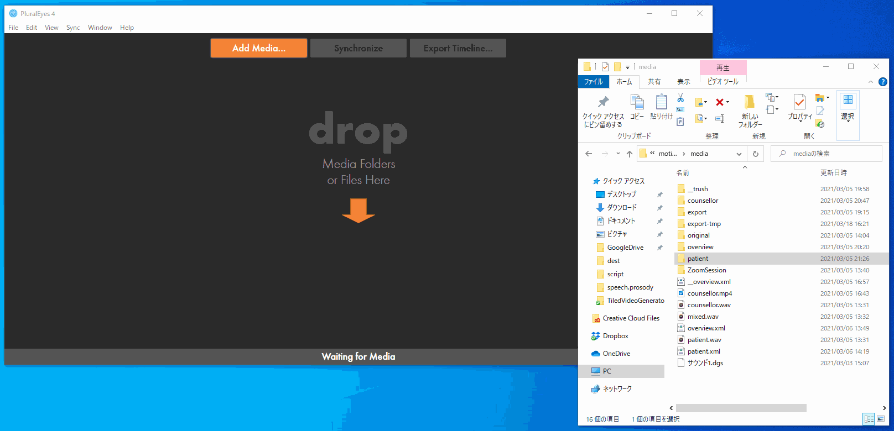
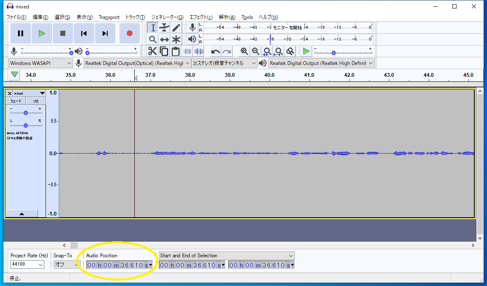

# 環境について

## .NET Core, powershell
.NET Coreがインストールされているかどうかの確認には，`powershell`で`dotnet --version`を入力すること．

powershellはwinなら標準でインストールされている．

## ffmpeg
適当にwebで検索してダウンロードしてください．

## PluralEyes
RedGiantのApplication Managerからインストールする．研究室ではPluralEyesのライセンスを購入しています．それを使う場合は，右上のハンバーガーメニューからライセンスを通せばよい．面倒ならRedGiantのアカウントを取得し，トライアル版を使うことも可能．


# 使い方

こちらが用意したテストデータ（`./sample`）で動作確認をすると安全．動作に必要なデータは以下．

- `./sample/sync.xml`: `PluralEyes`のメディア同期結果の出力ファイル
- `./sample/targets.txt`: セッション区間のリスト
- `./sample/medias`: 同期をとるための映像や音声データ

`./sample/medias`はGithubにはアップロードしない．NASに配置されているのでコピーすること．

実行前にこのディレクトリに配置されている`./sample`ディレクトリを，`C:\`直下に配置する．`PluralEyes`は取り込んだメディアファイルのパスを絶対パスとして扱う都合による．動作確認が出来たら`sample`ディレクトリは削除してよい．

## 実行手順


1. テキストエディタで`Run.ps1`を開き，以下の項目を変更する
   - `ffmpeg`のパス
   - 出力先ディレクトリ`$destDir`
1. `powershell`から以下コマンドを実行
   ```
   PS C:\(repo)> .\Run.ps1
   ```
1. `$destDir`に指定したディレクトリに色々作成される．作成されるファイルの詳細は以下．
   - セッション開始・終了時間を切り出した各種メディア
   - `MediaInfos.txt`: 入力されたxmlをパースしたファイル
   - `SyncAndTrim.ps1`, `Tiling.ps1`: 作業に必要な中間スクリプト
   - `video-*.txt`: （必要に応じて生成）トラックが複数のメディアから構成される場合，メディア間をつなぐパディング映像を作るための情報


## あなたのデータで実行するとき

1. `PluralEyes`を使用し，メディアの同期情報をxmlとして出力する
   1. まずはメディア間の同期をとる
       - 
       - 赤いクリップは同期に失敗したクリップ．理由はまちまちだが，自分で原因を究明するしかない．
   1. エクスポート．`Export Timeline`を押す．
       - 設定は変えない．以下参照．
       - 
       - 赤いクリップがない状態でエクスポートすること
1. 実験で収録した**音声データ**の音声波形を確認しながら，実験セッション開始時刻と終了時刻を`targets.txt`に記録する
   - 
   - Audacityを使うと便利
1. 上記`実行手順`に従い，実行する．
   - **注意**）`PluralEyes`に一番初めに投入された音声データが，タイル配置された映像の音声になる


# 周知事項

- `PluralEyes`関連
   - すべての映像データのフレームレートは統一しておくこと
      - 30が最も好ましい．次点で60か24．
      - 29.97や59.94は絶対に避けること．言い換えると，`30i`や`60i`設定のビデオカメラでの録画は避けること．
   - `.MTS`は`.mp4`に変換してから`PluralEyes`で同期とること
      - ffmpegとMTSは相性が悪い様子
   - 上記の各種変換には`MTStoMP4.ps1`を使うとよい
- SDカードに記録するタイプのビデオカメラで長回しした時には...
   - 記録された映像が複数のファイルに分割されてしまっている場合
   - （あまり好ましくないですが）基本的には対応可能です
   - 多くの場合，分割された二つのファイルはほんのわずかにオーバーラップしています
   - 上記理由から，`PluralEyes`で同期をとろうとすると失敗します
   - その場合は，すべての映像ファイルの先頭1秒ぐらいを削除した上で`PluralEyes`で同期をとるとうまくいきます
- `TiledVideoGenerator`関連
   - なんかエラー吐いた -> 状況を詳細に教えてください．対応します．
   - 2020/03現在，`.NET 5`では動作しませんでした．ちょっと対応します．
