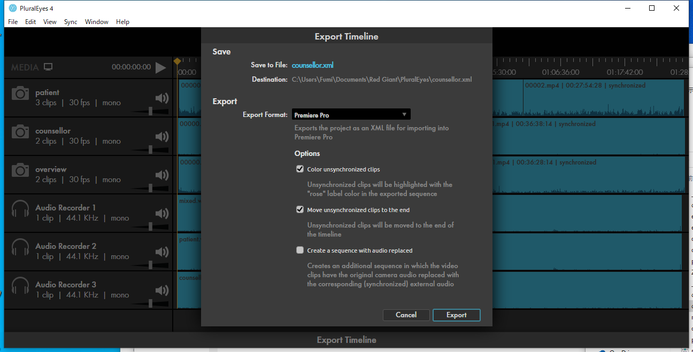
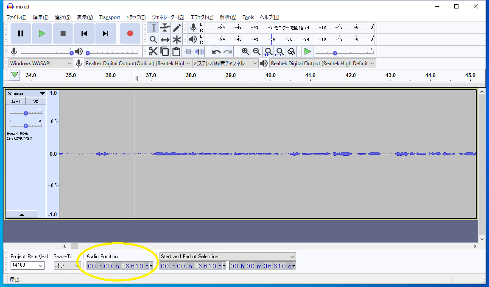

# 環境について

## .NET Core, powershell
.NET Coreがインストールされているかどうかの確認には，`powershell`で`dotnet --version`を入力すること．

powershellはwinなら標準でインストールされている．

## ffmpeg
適当にwebで検索してダウンロードしてください．

## PluralEyes
RedGiantのApplication Managerからインストールする．RedGiantのアカウントを取得し，トライアル版を使うことも可能．

（研究室ではPluralEyesのライセンスを購入しています．使う場合は要相談．）

## あなたのデータで実行するとき

1. `PluralEyes`を使用し，メディアの同期情報をxmlとして出力する
   1. まずはメディア間の同期をとる
       - 
       - 赤いクリップは同期に失敗したクリップ．理由はまちまちだが，自分で原因を究明するしかない．
   1. エクスポート．`Export Timeline`を押す．
       - 設定は変えない．以下参照．
       - 
       - 赤いクリップがない状態でエクスポートすること
1. 実験で収録した**音声データ**の音声波形を確認しながら，実験セッション開始時刻と終了時刻を`targets.txt`に記録する
   - ここで使用する音声データは，`PluralEyes`に最初に投入した音声データにすること
   - Audacityを使うと便利．以下の図における，黄色い丸で囲った場所を参照．
   - 
1. [実行手順](./README.md/#サンプルでの実行)に従い，実行する．
   - `PluralEyes`に最初に投入された音声データが，タイル配置された映像の音声になる

# `targets.txt`について

タブ（`\t`）区切りのテキストファイル．各行につきタイル並べされた映像が生成される．

各列の詳細は以下．

- `ID`: 生成物を保存するディレクトリ名や，各所に使用される．適当に決めてよい．
- `XmlPath`: `PluralEyes`により生成されたメディアの同期情報．
- `Start`: セッションの開始時間．フォーマットは`hh:mm:ss.fff`．
- `End`: セッションの開始時間．フォーマットは同上．

# 生成物

`$destDir`に指定したディレクトリに色々作成される．作成されるファイルの詳細は以下．
   - セッション開始・終了時間を切り出した各種メディア
   - `MediaInfos.txt`: 入力されたxmlをパースしたファイル
   - `SyncAndTrim.ps1`, `Tiling.ps1`: 作業に必要な中間スクリプト
   - `video-*.txt`: （必要に応じて生成）トラックが複数のメディアから構成される場合，メディア間をつなぐパディング映像を作るための情報

# その他周知事項

- `PluralEyes`関連
   - すべての映像データのフレームレートは統一しておくこと
      - 30が最も好ましい．次点で60か24．
      - 29.97や59.94は絶対に避けること．言い換えると，`30i`や`60i`設定のビデオカメラでの録画は避けること．
   - `.MTS`は`.mp4`に変換してから`PluralEyes`で同期とること
      - ffmpegとMTSは相性が悪い様子
   - 上記の各種変換には`MTStoMP4.ps1`を使うとよい
   - 投入する音声データはモノラルに変換しておくこと
- SDカードに記録するタイプのビデオカメラで長回しした時には...
   - 記録された映像が複数のファイルに分割されてしまっている場合
   - （あまり好ましくないですが）基本的には対応可能です
   - 多くの場合，分割された二つのファイルはほんのわずかにオーバーラップしています
   - 上記理由から，`PluralEyes`で同期をとろうとすると失敗します
   - その場合は，すべての映像ファイルの先頭1秒ぐらいを削除した上で`PluralEyes`で同期をとるとうまくいきます
   - このケースも`MTStoMP4.ps1`で対応できます
- `TiledVideoGenerator`関連
   - 音声ファイルが少なくとも一つ存在することが実行のための必須条件です．
   - `.NET 5`で動作させたい場合，`TiledVideoGenerator.csproj`の`TargetFramework`を変更すればいけます．
   - なんかエラー吐いた -> 状況を詳細に教えてください．対応します．

